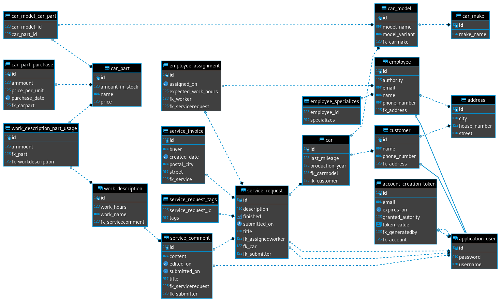
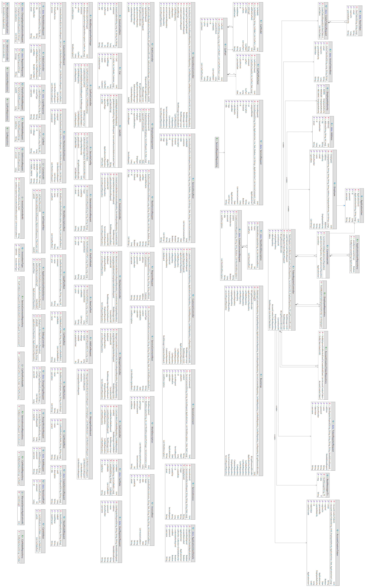

\clearpage

# Temat projektu: Oprogramowanie wspomagające pracę warsztatu.

Projekt znajduje się w repozytorium: <https://github.com/gbujak/projekt-pai>

## Zakres projektu

Przygotowanie programu, który wspomagałby pracę warsztatu. Zaimplementowanie
funkcjonalności, które opisaliśmy przy kategoriach użytkowników poniżej.

## Kategorie użytkowników i ich funkcjonalności

* Klient - konto klienta warsztatu. Może zamieścić na stronie opis problemu z
  samochodem. Otrzyma od pracownika spodziewany koszt naprawy i propozycje terminów.
  Może umówić się na wizytę. Może sprawdzać terminy swoich wizyt i stan napraw.

* Pracownik - otrzymuje od kierownika opisy problemów i wpisuje spodziewany koszt. W
  trakcie naprawy może dodawać nowe informacje do strony internetowej naprawy. Ma
  dostęp do danych kontaktowych klienta, który zlecił naprawę. Może zakończyć
  naprawę.

* Kierownik - otrzymuje nowe opisy problemów od klientów i decyduje, jakim
  pracownikom przydzielić naprawę. Może wygenerować adres url, który pozwoli na
  stworzenie konta pracownika. Może kasować konta pracowników i użytkowników.

* Administrator - może kasować wszystkie konta używkownika i wygenerować adres url
  pozwalający na stworzenie konta kierownika.

## Wykorzystywane technologie

* Angular
* Kotlin + Spring Boot
* Baza danych Postgresql

## Skład zespołu

* Grzegorz Bujak - grzegorzbujak10@gmail.com

    * temat z Inżynierii: niewybrany
    * temat z Podstaw Inżynierii Programowania: szkoła podstawowa
    * temat pracy inżynierskiej: niewybrany

* Arkadiusz Markowski - arekmarko8@gmail.com

    * temat z Inżynierii: niewybrany
    * temat z Podstaw Inżynierii Programowania: szkoła podstawowa
    * temat pracy inżynierskiej: niewybrany

* Marcin Majdański - majmarcin0@gmail.com

    * temat z Inżynierii: niewybrany
    * temat z Podstaw Inżynierii Programowania: Komisariat Policji
    * temat pracy inżynierskiej: niewybrany

## Podział pracy

* Grzegorz Bujak

    * Administrator
    * Kierownik
    * Konfiguracja Spring Security

* Arkadiusz Markowski

    * Klient (w programie, nie frontend)

* Marcin Majdański

    * Pracownik

# Przypadki użycia

* [Przypadki użycia użytkownika niezalogowanego](./niezalogowany.md)
* [Przypadki użycia klienta](./klient.md)
* [Przypadki użycia pracownika](./pracownik.md)
* [Przypadki użycia kierownika](./kierownik.md)

# Przypadki użycia klienta

## Stworzenie zgłoszenia

**1. Nazwa przypadku użycia**

Stworzenie zgłoszenia.

**1.1. Krótki opis**

Klient tworzy nowe zgłoszenie. Jest to opis usługi, jakiej chce od warsztatu.

**1.2. Aktorzy**

* Klient

**1.3 Wyzwalacze**

Klient wybiera opcję "stwórz zgłoszenie" z panelu głównego klienta.

**2. Przepływ zdarzeń**

**2.1. Przepływ podstawowy**

1. System pokazuje klientowi formularz. Prosi o podanie tytułu zgłoszenia, modelu i
   marki samochodu. Prosi o wybranie rodzaju usługi np. naprawa, czy serwis.
2. Klient podaje dane, zatwierdza stworzenie zgłoszenia.
3. System zapisuje zgłoszenie.

**2.2 Przepływy alternatywne**

2.2.1 Po wysłaniu formularzu system weryfikuje, że dana marka samochodu nie jest naprawiana w tym serwisie.

**3. Warunki początkowe**

*Klient musi być zalogowany na swoje konto użytkownika.

**4. Warunki końcowe**

Zgłoszenie zostało zapisane w systemie.

---

## Ocena wykonanej usługi

**1. Nazwa przypadku użycia**

Ocena wykonanej usługi.

**1.1. Krótki opis**

Po zaznaczeniu przez pracownika wykonania usługi klient dostaje opcję oceny wykonanej
usługi w panelu zgłoszenia.

**1.2. Aktorzy**

* Klient

**1.3 Wyzwalacze**

Klient otwiera panel zgłoszenia po zgłoszeniu przez pracownika wykonania usługi.

**2. Przepływ zdarzeń**

**2.1. Przepływ podstawowy**

1. System prosi użytkownika o ocenę wykonania usługi
2. Użytkownik daje ocenę pozytywną.
3. System zapisuje ocenę, archiwizuje zgłoszenie.

**2.2 Przepływy alternatywne**

2.2.1 Klient wystawił ocenę negatywną

3. System prosi użytkownika o powód wystawienia negatywnej oceny.
4. Użytkownik podaje powód.
5. System zapisuje ocenę, archiwizuje zgłoszenie.

**3. Warunki początkowe**

* W systemie istnieje zgłoszenie przypisane do klienta, którego stan jest ustawiony
  na "wykonane".

**4. Warunki końcowe**

* Zgłoszenie zostało zarchiwizowane.

---

## Podgląd aktualnego zgłoszenia

**1. Nazwa przypadku użycia**

Podgląd aktualnego zgłoszenia.

**1.1. Krótki opis**

Klient może sprawdzić stan swojego aktualnego zgłoszenia. Zgłoszenie może być w
trakcie i pokazać rzeczy zrobione i te, które zostały jeszcze do zrobienia oraz
zgłoszenie może być już zakończone i samochód oczekuje na odebranie.

**1.2. Aktorzy**

Klient

**1.3 Wyzwalacze**

Klient wybiera w panelu "pokaż aktualne zgłoszenia".

**2. Przepływ zdarzeń**

**2.1. Przepływ podstawowy**

1. Klientowi wyświetla się lista zgłoszeń, które są przypisane do jego konta.
2. Klient klika w "pokaż szczegóły" przy najświeższym zgłoszeniu.
3. System wyświetla dane o zgłoszeniu oraz informacje co zostało zrobione, a co
   zostało jeszcze do zrobienia.

**2.2 Przepływy alternatywne**

**3. Warunki początkowe**

* Klient musi być zalogowany.
* Do konta klienta musi być przypisane zgłoszenie.

**4. Warunki końcowe**

Klient zna aktualny stan serwisowania/naprawy swojego auta.

# Przypadki użycia kierownika

## Przypisanie pracownika do naprawy

**1. Nazwa przypadku użycia**

Przypisanie pracownika do naprawy.

**1.1. Krótki opis**

Kierownik wczytuje panel nowych zgłoszeń klientów. Przegląda zgłoszenia. Decyduje,
który pracownik nadaje się najbardziej do tego typu usługi. Gdy podejmie decyzję,
wybiera pracownika. U wybranego pracownika w systemie będzie widoczne nowe
zgłoszenie.

**1.2. Aktorzy**

* Kierownik

**1.3 Wyzwalacze**

Przypadek użycia rozpoczyna się, gdy kierownik wybierzę opcję "przypisz pracownika"
przy nowym zgłoszeniu od klienta.

**2. Przepływ zdarzeń**

**2.1. Przepływ podstawowy**

1. System pokazuje kierownikowi informacje o zgłoszeniu, jakie wpisał klient.
2. Kierownik wybiera opcję "przypisz pracownika".
3. System pokazuje kierownikowi listę pracowników.
4. Kierownik wybiera pracownika, którego chce przypisać do zgłoszenia.
5. System przypisuje pracownika do zgłoszenia.

**2.2 Przepływy alternatywne**

**3. Warunki początkowe**

* W systemie istnieje przynajmniej jedno zgłoszenie od klienta bez przypisanego
  pracownika.

**4. Warunki końcowe**

* Zgłoszenie zostanie przypisane do wybranego pracownika.
* Pracownik zobaczy to ogłoszenie przy następnym logowaniu.

---

## Tworzenie adresu URL pozwalającego na stworzenie konta pracownika

**1. Nazwa przypadku użycia**

Tworzenie adresu URL pozwalającego na stworzenie konta pracownika

**1.1. Krótki opis**

Normalnie w systemie jest możliwość stworzenia tylko konta klienta. Kierownik może
wygenerować adres URL, który pozwoli na stworzenie konta pracownika.

**1.2. Aktorzy**

* Kierownik

**1.3 Wyzwalacze**

Przypadek rozpoczyna się, gdy kierownik wybierzę opcję "nowy pracownik" w panelu
głównym w sytemie.

**2. Przepływ zdarzeń**

**2.1. Przepływ podstawowy**

1. System pyta kierownika ile chce wygenerować adresów i jak długo powinny być ważne.
2. Kierownik podaje ilość kluczy i jak długo powinny być ważne.
3. System tworzy podaną ilość jednorazowych adresów URL pozwalających na stworzenie
   konta pracownika, zapisuje, do kiedy są ważne w bazie danych. Wyświetla klucze
   kierownikowi.
4. Kierownik kopiuje klucze. Może wysyłać je pocztą e-mail do nowych pracowników
   (poza systemem).

**2.2 Przepływy alternatywne**

**3. Warunki początkowe**

**4. Warunki końcowe**

* Wygenerowane adresy działają tylko do ustalonej daty, pozwalają na założenie
  jednego konta pracownika.

---

## Transfer zgłoszenia do innego pracownika

**1. Nazwa przypadku użycia**

Transfer zgłoszenia do innego pracownika.

**1.1. Krótki opis**

Pracownik może zgłosić kierownikowi, że nie da rady wykonać zadania. Kierownik może
wtedy zmienić przypisanego do zgłoszenia pracownika.

Może też zamknąć zgłoszenie z wiadomością dla klienta, ale to inny przypadek.

**1.2. Aktorzy**

* Kierownik
* Pracownik

**1.3 Wyzwalacze**

Kierownik kliknie w jedno ze zgłoszeń w panelu "prośby o interwencję kierownika".

**2. Przepływ zdarzeń**

**2.1. Przepływ podstawowy**

1. System pokazuje kierownikowi przebieg zgłoszenia, przewija widok tak, żeby była na
   ekranie wybrana prośba o interwencję.
2. Kierownik czyta wiadomość, jaką załączył pracownik. Może zdecydować o konieczności
   przypisania zgłoszenia do innego pracownika. Klika opcję "transfer zgłoszenia".
3. System prosi kierownika o komentarz do operacji oraz wybór pracownika.
4. Kierownik wpisuje komentarz i wybiera pracownika.
5. System dodaje nowe wydarzenie do przebiegu zgłoszenia z opisem transferu.
   Przypisuje zgłosznie do wybranego przez kierownika pracownika.

**2.2 Przepływy alternatywne**

2.2.1 Kierownik decyduje, że nie dokona transferu.

3. System prosi kierownika o wiadomość dla pracownika.
4. Kierownik wpisuje wiadomość.
5. System dodaje wiadomość od kierownika do przebiegu zgłoszenia.

**3. Warunki początkowe**

* W sytemie jest przynajmniej jedna prośba o interwencję kierownika.

**4. Warunki końcowe**

* Zgłoszenie jest przypisane do innego pracownika, niż oryginalnie.

# Przypadki użycia pracownika

## Zaczęcie naprawy

**1. Nazwa przypadku użycia**

Zaczęcie naprawy.

**1.1. Krótki opis**

Pracownik otrzymuje od kierownika zlecenie naprawy. Widzi w systemie co ma zrobić
i rozpoczyna przydzielone zadanie. Od tego momentu realizuje zlecenie, przed którego skończeniem
nie zajmuje się nowymi zleceniami.

**1.2. Aktorzy**

* Pracownik

**1.3 Wyzwalacze**

Przypadek użycia rozpoczyna się, gdy pracownik wybierze opcję "Zobacz zlecenia"
na swoim koncie i kliknie w nowe zlecenie.

**2. Przepływ zdarzeń**

**2.1. Przepływ podstawowy**

1. Pracownik loguje się do systemu.
2. System pokazuje pracownikowi jego profil.
3. Pracownik wybiera opcję "Zobacz zlecenia".
4. System wyświetla pracownikowi przypisane do niego zlecenie.
5. Pracownik wybiera zlecenie.
6. System odnotowuje, że pracownik odebrał i przeczytał zlecenie.

**2.2 Przepływy alternatywne**

**3. Warunki początkowe**

* W systemie istnieje przynajmniej jedno zgłoszenie przypisane do pracownika.

**4. Warunki końcowe**

* Zgłoszenie zostało odczytane przez pracownika.


---

## Zakończenie Wykonywanego Zlecenia

**1. Nazwa przypadku użycia**

Zakończenie Wykonywanego Zlecenia

**1.1. Krótki opis**

Po wykonaniu wszystkich prac, pracownik zakańcza zlecenie. Żeby móc rozliczyć się z klientem
i poinformować kierownika, że jest już wolny i może być przypisany do kolejnego zlecenia.

**1.2. Aktorzy**

* Pracownik

**1.3 Wyzwalacze**

Przypadek rozpoczyna się, gdy pracownik wybierze opcję "Zaktualizuj Zlecenie" w systemie

**2. Przepływ zdarzeń**

**2.1. Przepływ podstawowy**

1. Pracownik loguje się do systemu.
2. System wyświetla profil pracownika.
3. Pracownik wybiera opcję "Zaktualizuj Zlecenie"
4. System wyświetla pracownikowi jego aktualnie robione zlecenie.
5. Pracownik wybiera opcję "Zakończ zlecenie".
6. System przesyła informację do kierownika że pracownik zakończył zlecenie i jest wolny. I jednocześnie przekierowuje pracownika do strony rozliczeniowej

**2.2 Przepływy alternatywne**

**3. Warunki początkowe**

* Pracownik posiada przypisane do niego zlecenie, które jest zaczęte.

**4. Warunki końcowe**

* Zlecenie jest odnotowane w systemie jako zakończone. Pracownik znowu widnieje jako wolny w systemie.

---

## Wystawienie klientowi Faktury

**1. Nazwa przypadku użycia**

Wystawienie Klientowi Faktury.

**1.1. Krótki opis**

Pracownik po zakończeniu zlecenia, wystawia rachunek klientowi za wykonane prace
i wysyła mu fakturę w celu uregulowania należności.

**1.2. Aktorzy**

* Pracownik

**1.3 Wyzwalacze**

Pracownik zakończył wykonywane zlecenie.

**2. Przepływ zdarzeń**

**2.1. Przepływ podstawowy**

1. Po zakończeniu zlecenia przez pracownika, system przekierowuje go do strony rozliczeniowej gdzie jest formularz.
2. Pracownik wypełnia informacje w formularzu, takie jak koszty, dane klienta, dane pracownika.
3. Po wypełnieniu formularza, pracownik wybiera opcję "Zatwierdź". Tym samym zapisując informacje systemie.
4. System przyjmuje formularz i tworzy fakturę.
5. System przesyła fakturę do klienta.

**2.2 Przepływy alternatywne**


**3. Warunki początkowe**

* Przynajmniej jedno zlecenie przypisane do dowolnego pracownika jest zakończone.

**4. Warunki końcowe**

* Klient otrzymuje na swoje konto fakturę.

# Przypadki użycia użytkownika niezalogowanego

## Stworzenie konta pracownika

**1. Nazwa przypadku użycia**

Stworzenie konta pracownika.

**1.1. Krótki opis**

Niezalogowany użytkownik tworzy konto pracownika.

**1.2. Aktorzy**

* Niezalogowany użytkownik

**1.3 Wyzwalacze**

* Niezalogowany użytkownik otwiera udostępniony mu przez kierownika adres URL służący
  do tworzenia konta pracownika.

**2. Przepływ zdarzeń**

**2.1. Przepływ podstawowy**

1. System sprawdza, czy kod zawarty w adresie URL jest nadal aktualny.
2. System prosi użytkownika o podanie imienia, nazwiska, loginu i hasła.
3. Użytkownik podaje dane.
4. System tworzy konto pracownika.

**2.2 Przepływy alternatywne**

2.2.1 Kod tworzenia konta pracownika wygasł

2. System informuje użytkownika, że kod wygasł. Sugeruje kontakt z kierownikiem.
3. Koniec przypadku użycia.

**3. Warunki początkowe**

* Podany przez niezalogowanego użytkownika kod został wcześniej wygenerowany przez
  konto kierownika.

**4. Warunki końcowe**

* W systemie znajduje się nowe konto pracownika z podanymi przez niezalogowanego
  użytkownika danymi.

## Stworzenie konta klienta

**1. Nazwa przypadku użycia**

Stworzenie konta klienta.

**1.1. Krótki opis**

Niezalogowany użytkownik tworzy konto klienta.

**1.2. Aktorzy**

* Niezalogowany użytkownik

**1.3 Wyzwalacze**

* Niezalogowany użytkownik otwiera stronę serwisu i wybiera przycisk "zarejestruj się".

**2. Przepływ zdarzeń**

**2.1. Przepływ podstawowy**

1. System prosi użytkownika o podanie imienia, nazwiska, loginu i hasła.
2. Użytkownik podaje dane.
3. System sprawdza czy nie istnieje już użytkownik o podanych wcześniej danych.
4. System tworzy konto dla klienta.

**2.2 Przepływy alternatywne**

3.2.1 System znalazł użytkownika pasujacego do podanych danych.
2. Użytkownik może poprawić dane lub się zalogować.

**3. Warunki początkowe**

* Klient nie może mieć już założonego konta użytkownika.

**4. Warunki końcowe**

* Klient posiada konto.

\clearpage

# Diagram ER encji

{width=100%}

# Diagram UML klas w aplikacji

{width=100%}

\clearpage

# Opisy kontrolerów

## CustomerController.kt

Kontroler klienta zawiera implementacje czynności, jakie może wykonać klient w
systemie. 

### Klasy pomocnicze

```kotlin
class RegisterRequest(
    val username: String,
    val password: String,
    val name: String,
    val phoneNumber: String,
    val address: Address,
) {
    fun toCustomer() = Customer(username, password, name, phoneNumber, address)
}

class AddCarRequest(
    val productionYear: Int,
    val mileage: Int,
    val modelId: Long,
    val makeId: Long,
)

class CustomerDashboard(
    inputServices: List<ServiceRequest>,
    inputCars: List<Car>,
    val services: List<RestServiceRequest> = inputServices.map { RestServiceRequest(it) },
    val finishedServices: List<RestServiceRequest> = inputServices
        .filter { it.finished }.map { RestServiceRequest(it) },
    val cars: List<CarRest> = inputCars.map { CarRest(it) },
)
```

### Klasa kontrolera

- `CustomerController.register` - implementacja rejestracji konta klienta.
- `CustomerController.addCar` - dodawanie nowego samochodu przypisanego do konta
  klienta. Klient może tworzyć nową usługę dotyczącą jednego z samochodów
  przypisanego do konta.
- `CustomerController.getDashboard` - pobieranie informacji do strony głównej
  klienta. Dzięki temu rozwiązaniu, przeglądarka wykonuje mniej zapytań HTTP przy
  ładowaniu strony.

```kotlin
@RestController
@RequestMapping("/api/customer")
class CustomerController(
    val customerRepository: CustomerRepository,
    val applicationUserRepository: ApplicationUserRepository,
    val carModelRepository: CarModelRepository,
    val carMakeRepository: CarMakeRepository,
    val carRepository: CarRepository,
    val currentUserUtil: CurrentUserUtil,
) {
    @PostMapping("/register")
    fun register(@RequestBody registerRequest: RegisterRequest) : RestMessage<Unit> {
        if (applicationUserRepository.findByUsername(registerRequest.username) != null) {
            return RestMessage("Błąd: nazwa użytkownika już istnieje")
        }
        val customer = customerRepository.save(registerRequest.toCustomer())
        return RestMessage("Ok")
    }

    @PostMapping("/add-car")
    fun addCar(@RequestBody addCarRequest: AddCarRequest): RestMessage<Long> {
        val makeOpt = carMakeRepository.findById(addCarRequest.makeId)
        if (makeOpt.isEmpty) {
            return RestMessage("Błąd: marka o takim id nie istnieje")
        }
        val make = makeOpt.get()

        val modelOpt = carModelRepository.findById(addCarRequest.modelId)
        if (modelOpt.isEmpty) {
            return RestMessage("Błąd: nie ma modelu o takim id")
        }
        val model = modelOpt.get()
        if (make.carModels.filter { it.id == model.id }.size != 1) {
            return RestMessage("Błąd: podany model nie należy do podanej marki")
        }

        val user = currentUserUtil.getCurrentUserIfVariant<Customer>()
        if (user == null) return RestMessage("Błąd: konto nie jest kontem klienta")


        val car = carRepository.save(addCarRequest.let {
            Car(it.productionYear, it.mileage, model, user)
        })

        return RestMessage("Ok", car.id)
    }

    @GetMapping("/dashboard")
    fun getDashboard(): RestMessage<CustomerDashboard> {
        val user = currentUserUtil.getCurrentUserIfVariant<Customer>()
        return if (user == null) RestMessage("Błąd: nie jesteś klientem")
        else RestMessage("Ok", CustomerDashboard(user.serviceRequests, user.cars))
    }
}
```
## CarController.kt

Kontroler zawiera logikę zarządzania samochodami. Przyjęliśmy, że kierownik będzie
ustalał, jakie modele samochodów są obsługiwane w warsztacie. Kierownik może dodawać
nowe modele.

Funkcja ta jest związana z funkcją kontolera
[CarPartController.kt](./CarPartController.md).

Ten kontroler pozwala kierowanikowi dodawać części, jakich mechanicy będą mogli
używać przy dodawaniu opisów pracy do komentarzy do historii serwisu.

### Klasy pomocnicze

```kotlin
class NewMakeRequest(val makeName: String)
class NewModelRequest(val makeId: Long, val modelName: String, val modelVariant: String)

class CarMakeRest(
    carMake: CarMake,
    val name: String = carMake.makeName,
    val id: Long = carMake.id,
    val carModels: List<CarModelRest> = carMake.carModels.map { CarModelRest(it) },
)

class CarModelRest(
    carModel: CarModel,
    val name: String = carModel.modelName,
    val variant: String = carModel.modelVariant,
    val id: Long = carModel.id,
)

class CarInfoRest(
    makes: List<CarMake>,
    val carInfo: List<CarMakeRest> = makes.map { CarMakeRest(it) },
)
```

### Klasa kontolera

- `CarController.newMake` - tworzenie nowej marki samochodu.
- `CarController.newModel` - tworzenie nowego modelu samochodu, który będzie
  obsługiwany w warsztacie.
- `CarController.carInfo` - zwracanie informacji o samochodzie. Jest to używane na
  przykład przy tworzeniu nowej usługi przez klienta. Klient wybiera z listy
  obsługiwanych modeli.

```kotlin
@RestController
@RequestMapping("/api/car")
class CarController (
    val carModelRepository: CarModelRepository,
    val carMakeRepository: CarMakeRepository,
) {
    @GetMapping("/info")
    fun carInfo(): RestMessage<CarInfoRest>
        = RestMessage("Ok", CarInfoRest(carMakeRepository.findAll().toList()))

    @PostMapping("/new-make")
    fun newMake(@RequestBody req: NewMakeRequest): RestMessage<Long> {
        val make = carMakeRepository.save(CarMake(req.makeName))
        return RestMessage("Ok", make.id)
    }

    @RequestMapping("new-model")
    fun newModel(@RequestBody req: NewModelRequest): RestMessage<Unit> {
        val makeOpt = carMakeRepository.findById(req.makeId)
        if (makeOpt.isEmpty) return RestMessage("Błąd: nie ma takiej marki")
        val make = makeOpt.get()
        make.newModel(req.modelName, req.modelVariant)
        val model = CarModel(req.modelName, req.modelVariant, null)
        make.carModels.add(model)
        carMakeRepository.save(make)
        return RestMessage("Ok")
    }
}
```
## AdminController.kt

Kontroler AdminController zawiera implementacje funkcji administratora systemu. Są to
między innymi kasowanie kont użytkowników, kasowanie komentarzy z historii serwisu
itd.

Nie zdążyliśmy zaimplementować funkcji administratora. Funkcje niezbędne do
korzystania z systemu są sprawowane przez kierownika.

## ManagerController.kt

Kontroler zawiera funkcje ładowania danych do strony startowej kierownika oraz
przypisywania pracownika od usługi. Przypisywanie mechanika do usługi jest dość
skomplikowane, ale większość tej logiki znajduje się w kliencie. Uznaliśmy, że
niepotrzebne jest sprawdzanie na serwerze, czy kompetencje mechanika zawierają
wszystkie tagi opisujące usługę. Jest to sprawdzane na kliencie.

### Klasy pomocnicze

```kotlin
class ManagerDashboard (
    serviceRequests: List<ServiceRequest>,
    _mechanics: List<Employee>,
    val mechanics: List<RestMechanic> = _mechanics.map { RestMechanic(it) },
    val unassignedServiceRequests: List<RestServiceRequest> =
        serviceRequests.filter { it.assignedWorker == null }
        .map { RestServiceRequest(it) },
    val activeServiceRequests: List<RestServiceRequest> =
        serviceRequests.map { RestServiceRequest(it) }
)

class RestMechanic(
    mechanic: Employee,
    val id: Long = mechanic.id,
    val name: String = mechanic.name,
    val specializes: List<String> = mechanic.specializes,
)

class AssignWorkerRequest (
    val serviceRequestId: Long,
    val workerId: Long,
)
```

### Klasa kontrolera

- `ManagerController.getDashboard` - dane do strony startowej kierownika.
- `ManagerController.assignWorker` - przypisanie pracownika do usługi.

```kotlin
@RestController
@RequestMapping("/api/manager")
class ManagerController(
    val currentUserUtil: CurrentUserUtil,
    val serviceRequestRepository: ServiceRequestRepository,
    val employeeRepository: EmployeeRepository,
) {
    @GetMapping("/dashboard")
    fun getDashboard(): RestMessage<ManagerDashboard> {
        val user = currentUserUtil.getCurrentUserIfVariant<Employee>()
        if (user == null ||
            !listOf(EmployeeAuthority.MANAGER, EmployeeAuthority.ADMIN).contains(user.authority))
                    return RestMessage("Błąd: nie jesteś kierownikiem albo administratorem")

        val repositories = serviceRequestRepository.findAll().toList()
        val mechanics = employeeRepository.findAllByAuthority(EmployeeAuthority.MECHANIC)

        return RestMessage("Ok", ManagerDashboard(repositories, mechanics))
    }

    @PostMapping("/assign-worker")
    fun assignWorker(@RequestBody assignWorkerRequest: AssignWorkerRequest): RestMessage<Unit> {
        val employee = employeeRepository.findById(assignWorkerRequest.workerId)
        if (employee.isEmpty()) return RestMessage("Błąd: pracownik nie istnieje")

        val serviceRequest = serviceRequestRepository.findById(assignWorkerRequest.serviceRequestId)
        if (serviceRequest.isEmpty()) return RestMessage("Błąd: usługa nie istnieje")

        val req = serviceRequest.get()
        req.assignedWorker = employee.get()
        serviceRequestRepository.save(req)

        return RestMessage("Ok")
    }
}
```
## ServiceStoryController.kt

Kontroler implementuje wszystkie funkcje związane z historią usługi. Jest to
największy kontroler w całej aplikacji.

### Klasy pomocnicze

```kotlin
data class CreateServiceRequest(val title: String, val description: String, val carId: Long)

data class NewUsedPart (
    val id: Long,
    val ammount: Int,
)

data class NewWorkDescription (
    val name: String,
    val hours: Int,
    val usedParts: List<NewUsedPart>,
)

data class CreateCommentRequest(
    val serviceId: Long,
    val title: String,
    val content: String,
    val finishesService: Boolean,

    val workDescriptions: List<NewWorkDescription>,
)

data class ChangeTagsRequest (
    val serviceId: Long,
    val newTags: List<String>,
)

class ServiceStoryRest(
    serviceRequest: ServiceRequest,
    val hasInvoice: Boolean,
    val id: Long = serviceRequest.id,
    val title: String = serviceRequest.title,
    val carModelId: Long = serviceRequest.car.model.id,
    val finished: Boolean = serviceRequest.finished,
    val description: String = serviceRequest.description,
    val tags: List<String> = serviceRequest.tags,
    val date: Date = serviceRequest.submittedOn,
    val submitter: String = serviceRequest.submitter.username,
    val comments: List<ServiceCommentRest> = serviceRequest
        .serviceComments.map { ServiceCommentRest(it) },
)

class ServiceCommentRest(
    serviceComment: ServiceComment,
    val title: String = serviceComment.title,
    val content: String = serviceComment.content,

    val submitter: String = if (Hibernate.unproxy(serviceComment.submitter) is Employee)
        (Hibernate.unproxy(serviceComment.submitter) as Employee).name
        else serviceComment.submitter.username,

    val accountType: String = if (Hibernate.unproxy(serviceComment.submitter) is Employee)
        (Hibernate.unproxy(serviceComment.submitter) as Employee).authority.name.toLowerCase()
        else "customer",

    val submittedOn: Date = serviceComment.submittedOn,

    val workDescriptions: List<WorkDescriptionRest> =
        serviceComment.workDescriptions.map { WorkDescriptionRest(it) }
)

class WorkDescriptionRest(
    workDescription: WorkDescription,
    val name: String = workDescription.workName,
    val hours: Int = workDescription.workHours,
    val usedParts: List<UsedPartRest> = workDescription.partUsages.map { UsedPartRest(it) }
)

class UsedPartRest(
    usage: WorkDescriptionPartUsage,
    val name: String = usage.carPart.name,
    val price: Long = usage.carPart.price,
    val ammount: Int = usage.ammount,
)
```

### Klasa kontrolera

- `ServiceStoryController.create` - tworzenie nowej historii serwisu. Jest wywoływane
  przez klienta.
- `ServiceStoryController.comment` - tworzenie komentarza do historii serwisu. Jest
  to bardzo ważna funkcja. Pracownik może dodać do komentarza kilka opisów pracy, a
  każdy opis pracy może zawierać kilka wykorzystanych części. Takie rozwiązanie
  generuje przejrzysty spis kosztów dla klienta, który jest widoczny w widoku
  historii serwisu oraz w widoku faktury.
- `ServiceStoryController.storyAll` - wczytanie wszystkich informacji o historii
  usługi. Redukuje to liczbę zapytań przy ładowaniu strony.
- `ServiceStoryController.changeTags` - zmiana "tagów" opisujących historię usługi.
  Jest to bardzo ważna funkcja. Tagi decydują, jakiego pracownika należy przypisać do
  historii usługi.

```kotlin
@RestController
@RequestMapping("/api/service-story")
class ServiceStoryController(
    val serviceRequestRepository: ServiceRequestRepository,
    val serviceCommentRepository: ServiceCommentRepository,
    val carPartRepository: CarPartRepository,
    val carRepository: CarRepository,
    val currentUserUtil: CurrentUserUtil,
    val serviceInvoiceRepository: ServiceInvoiceRepository,
) {
    @PostMapping("/create")
    fun create(@RequestBody request: CreateServiceRequest): RestMessage<Long> {
        val (title, desc, carId) = request
        val car = carRepository.findById(carId)
        if (car.isEmpty) return RestMessage("Błąd: nie ma takiego samochodu")
        val submitter = currentUserUtil.getCurrentUser()
        val result = serviceRequestRepository.save(ServiceRequest(title, desc, submitter, car.get()))
        return RestMessage("Ok", result.id)
    }

    @PostMapping("/create-comment")
    fun comment(@RequestBody request: CreateCommentRequest): RestMessage<Unit> {
        val submitter = currentUserUtil.getCurrentUser()
        val serviceOpt = serviceRequestRepository.findById(request.serviceId)
        if (serviceOpt.isEmpty) {
            return RestMessage("Nie znaleziono takiego id")
        }

        val service = serviceOpt.get()

        if (request.workDescriptions.isNotEmpty()) {
            if (submitter !is Employee) {
                return RestMessage("Błąd: tylko pracownicy mogą dodawać opisy pracy")
            }
            if (service.finished) {
                return RestMessage("Błąd: dodawanie pracy do zakończonej usługi")
            }
        }

        val comment = ServiceComment(
            title = request.title,
            content = request.content,
            serviceRequest = service,
            submitter = submitter,
        )

        for (desc in request.workDescriptions) {
            val newDesc = WorkDescription(desc.name, desc.hours, mutableListOf(), comment)
            for (usedPart in desc.usedParts) {
                val partOpt = carPartRepository.findById(usedPart.id)
                if (partOpt.isEmpty) return RestMessage("Błąd: część o takim id nie istnieje")
                val part = partOpt.get()
                newDesc.partUsages.add(WorkDescriptionPartUsage(newDesc, part, usedPart.ammount))
            }
            comment.workDescriptions.add(newDesc)
        }

        serviceCommentRepository.save(comment)

        if (request.finishesService) {
            service.finished = true
            serviceRequestRepository.save(service)
        }

        return RestMessage("Ok")
    }

    @GetMapping("/all/{id}")
    fun storyAll(@PathVariable("id") id: Long): RestMessage<ServiceStoryRest> {
        val serviceRequest = serviceRequestRepository.findById(id)
        if (serviceRequest.isEmpty) {
            return RestMessage("Nie znaleziono takiego id")
        }
        return RestMessage("Ok", ServiceStoryRest(
            serviceRequest.get(),
            serviceInvoiceRepository.findByService(serviceRequest.get()) != null
        ))
    }

    @PostMapping("change-tags")
    fun changeTags(@RequestBody changeTagsRequest: ChangeTagsRequest): RestMessage<Unit> {
        val user = currentUserUtil.getCurrentUserIfVariant<Employee>()

        if (user == null) {
            return RestMessage("Błąd: nie masz uprawnień")
        }

        val serviceOpt = serviceRequestRepository.findById(changeTagsRequest.serviceId)
        if (serviceOpt == null) {
            return RestMessage("Błąd: nie ma usługi o takim id")
        }
        val service = serviceOpt.get()

        service.tags = changeTagsRequest.newTags
        serviceRequestRepository.save(service)

        return RestMessage("Ok")
    }
}
```
### MechanicController

Kontroler mechanika odpowiada za dwie funkcje. Pierwsza to (tak jak inne kontrolery
użytkowników) zwracanie informacji do strony głównej. Druga opcja to zmiana
specjalizacji. Decydują one o tym, jakiego pracownika wybierze kierownik do
realizacji danej usługi.

### Klasy pomocnicze

```kotlin
data class MechanicDashboard(
    val unassigned: List<RestServiceRequest>,
    val assigned: List<RestServiceRequest>,
    val specializations: List<String>,
)

data class ChangeSpecializationsRequest(
    val newSpecializations: List<String>,
)
```

### Klasa kontrolera

- `MechanicController.getDashBoard` - informacje do strony głównej
- `MechanicController.changeSpecializations` - zmiana specjalizacji

```kotlin
@RestController
@RequestMapping("/api/mechanic")
class MechanicController(
    val serviceRequestRepository: ServiceRequestRepository,
    val currentUserUtil: CurrentUserUtil,
    val employeeRepository: EmployeeRepository,
) {
    @PostMapping("dashboard")
    fun getDashBoard(): RestMessage<MechanicDashboard> {
        val serviceRequests = serviceRequestRepository.findAll()
        val currentUser = currentUserUtil.getCurrentUserIfVariant<Employee>()!!

        val dashboard = MechanicDashboard(
            unassigned = serviceRequests
                .filter { it.assignedWorker == null }
                .map { RestServiceRequest(it) },
            assigned = serviceRequests
                .filter { it.assignedWorker != null && it.assignedWorker!!.id == currentUser.id }
                .map { RestServiceRequest(it) },
            specializations = currentUser.specializes,
        )

        return RestMessage("Ok", dashboard)
    }

    @PostMapping("change-specializations")
    fun changeSpecializations(@RequestBody req: ChangeSpecializationsRequest): RestMessage<Unit> {
        val curUser = currentUserUtil.getCurrentUserIfVariant<Employee>()!!
        val userOpt = employeeRepository.findById(curUser.id)
        val user = userOpt.get()
        user.specializes = req.newSpecializations
        employeeRepository.save(user)
        return RestMessage("Ok")
    }
}
```
## AuthController.kt

Jest to kontroler, w którym zaimplementowaliśmy funkcje logowania i rejestracji.
Aplikacja używa technologii Json Web Token (JWT) do uwierzytelniania. Tokeny są
generowane przez metodę login tego kontrolera. Metoda register zawiera logikę
tworzącą konta użytkowników i zapisującą je do bazy danych.

### Klasy pomocnicze

```kotlin
data class AuthRequest(val username: String, val password: String)
data class LoginResponse(val token: String, val username: String, val accountType: String)
data class RegisterResponse(val message: String)

data class UserRegisterRequest (
    val username: String,
    val password: String,
    val name: String,
    val phoneNumber: String,
    val address: NewAddressRequest,
)
```

### Klasa kontrolera

- `AuthController.register` - rejestracja bez tokena tworzenia konta. Metoda ta jest
  wywoływana przy rejestracji konta użytkownika.
- `AuthController.login` - logowanie się. Tutaj jest tworzony token JWT. Każdy
  użytkownik aplikacji loguje się z wykorzystaniem tej metody.

```kotlin
@RestController
@RequestMapping("/api/auth")
class AuthController (
    val applicationUserRepository: ApplicationUserRepository,
    val bCryptPasswordEncoder: BCryptPasswordEncoder,
    val authenticationManager: AuthenticationManager,
    val customerRepository: CustomerRepository,
    val jwtUtil: JwtUtil,
) {
    @PostMapping("register")
    fun register(@RequestBody req: UserRegisterRequest): RestMessage<Unit> {
        val customer = Customer(
            req.username,
            bCryptPasswordEncoder.encode(req.password),
            req.name,
            req.phoneNumber,
            Address(
                req.address.city,
                req.address.street,
                req.address.houseNumber,
            ),
        )
        customerRepository.save(customer)
        return RestMessage("Ok")
    }

    @PostMapping("/login")
    fun login(@RequestBody authRequest: AuthRequest): ResponseEntity<LoginResponse> {
        val (username, password) = authRequest
        try {
            val authentication = authenticationManager
                .authenticate(UsernamePasswordAuthenticationToken(username, password))
            val user = authentication.principal as ApplicationUserDetails
            val applicationUser = applicationUserRepository.findByUsername(user.username)!!
            val token = jwtUtil.userToken(user.username)
            return ResponseEntity.ok()
                .header(HttpHeaders.AUTHORIZATION, token)
                .body(LoginResponse(token, applicationUser.username,
                    if (applicationUser is Employee) applicationUser.authority.name.toLowerCase()
                    else "customer"))
        } catch (e: Exception) {
            throw e
        }
    }
}
```
## CarPartController.kt

Kontroler zawierający logikę zarządzania częściami w aplikacji. Pozwala na tworzenie
nowych części oraz dostawanie informacji, jakie części można użyć do serwisu
samochodu o danym modelu.

Jest to używane przy tworzeniu opisu pracy w komentarzu do historii serwisu.

### Klasy pomocnicze

```kotlin
class NewCarPart(
    val name: String,
    val price: Long,
    val ammountInStock: Long,
    val carModels: List<Long>,
)

class PartForModel (
    carPart: CarPart,
    val id: Long = carPart.id,
    val name: String = carPart.name,
    val price: Long = carPart.price,
    val amountInStock: Long = carPart.amountInStock,
)

class PartsForModelRequest (val modelId: Long)
```

### Klasa kontrolera

- `CarPartController.createNew` - tworzenie nowej części.
- `CarPartController.partsForModel` - części pasujące do danego modelu.

```kotlin
@RestController
@RequestMapping("/api/car-part")
class CarPartController (
    val carPartRepository: CarPartRepository,
    val carModelRepository: CarModelRepository,
) {
    @PostMapping("/create")
    fun createNew(@RequestBody newCarPart: NewCarPart): RestMessage<Long> {
        val carModels = mutableListOf<CarModel>()

        for (modelId in newCarPart.carModels) {
            val model = carModelRepository.findById(modelId)
            if (model.isEmpty) return RestMessage("Błąd: model o takim ID nie istnieje")
            carModels.add(model.get())
        }

        var carPart = CarPart(
            newCarPart.name,
            newCarPart.price,
            newCarPart.ammountInStock,
            carModels,
            mutableListOf(),
        )

        carPart = carPartRepository.save(carPart)
        println(carPart)
        println(carPart.carModels.map { it.modelName })
        return RestMessage("Ok", carPart.id)
    }

    @PostMapping("for-model")
    fun partsForModel(@RequestBody req: PartsForModelRequest): RestMessage<List<PartForModel>> {
        val model = carModelRepository.findById(req.modelId)
        if (model.isEmpty) return RestMessage("Błąd: nie ma modelu o takiej nazwie")

        return RestMessage(
            "Ok",
            model.get().carParts.map { PartForModel(it) }
        )
    }
}
```
## InvoiceController.kt

### Klasy i funkcje pomocnicze

- `fun workDescriptionToInvoiceItems` - funkcja zbierająca wszystkie elementy
  historii usługi posiadające cenę i konwertująca je do elementów faktury. Dzięki
  takiemu rozwiązaniu zapobiegliśmy duplikacji danych w historii usługi i w fakturze.
  **Jest to bezpieczne, bo system nie pozwala na dodawanie opisów pracy do komentarza
  do usługi zakończonej. Z tego powodu zawartość faktury nigdy się nie zmieni.**
- `fun invoiceIdDateToNumber` - funkcja tworząca numer faktury. Numer faktury nie
  jest przechowywany w bazie danych w celu uniknięcia duplikacji danych. Jest
  generowany z niezmiennych pól faktury - daty utworzenia i id w bazie danych.

```kotlin
class GenerateInvoiceRequest(
    val serviceId: Long,
    val buyer: String,
    val street: String,
    val postalCity: String,
)

class GetInvoiceRequest(val serviceId: Long)

class InvoiceRest (
    serviceInvoice: ServiceInvoice,
    val nr: String = invoiceIdDateToNumber(serviceInvoice.id, serviceInvoice.createdDate),
    val date: Date = serviceInvoice.createdDate,
    val buyer: String = serviceInvoice.buyer,
    val street: String = serviceInvoice.street,
    val postalCity: String = serviceInvoice.postalCity,

    val items: List<InvoiceCostItem> = serviceInvoice
        .service
        .serviceComments
        .flatMap { it.workDescriptions }
        .flatMap { workDescriptionToInvoiceItems(it) },
)

fun workDescriptionToInvoiceItems(workDescription: WorkDescription): List<InvoiceCostItem> {
    val result = mutableListOf<InvoiceCostItem>()

    result.add(InvoiceCostItem(
        name = workDescription.workName,
        cost = 20_00,
        ammount = workDescription.workHours,
        unit = "godzin",
        taxPercent = 5,
        type = InvoiceItemType.SERVICE.name.toLowerCase(),
    ))

    for (partUsage in workDescription.partUsages) {
        result.add(InvoiceCostItem(
            name = partUsage.carPart.name,
            cost = partUsage.carPart.price,
            ammount = partUsage.ammount,
            unit = "sztuk",
            taxPercent = 23,
            type = InvoiceItemType.RESOURCE.name.toLowerCase(),
        ))
    }

    return result.toList()
}

fun invoiceIdDateToNumber(id: Long, date: Date): String {
    val calendar = Calendar.getInstance()
    calendar.time = date
    val year = calendar.get(Calendar.YEAR)

    return "FV $id/$year"
}

enum class InvoiceItemType {
    SERVICE,
    RESOURCE,
}

class InvoiceCostItem (
    val name: String,
    val cost: Long,
    val ammount: Int,
    val unit: String,
    val taxPercent: Int,
    val type: String,
)
```

### Klasa kontrolera

- `InvoiceController.generate` - funkcja implementuje generowanie faktury dla
  historii serwisu. Dostaje dane o kupującym niezbędne do wygenerowania faktury.
- `InvoiceController.getInvoice` - funkcja zwracająca dane o fakturze. Jest dość
  skomplikowana obliczeniowo, ale umożliwia to uniknięcie duplikacji danych.


```kotlin
@RestController
@RequestMapping("/api/invoice")
class InvoiceController(
    val serviceInvoiceRepository: ServiceInvoiceRepository,
    val serviceRequestRepository: ServiceRequestRepository,
    val currentUserUtil: CurrentUserUtil,
) {
    @PostMapping("generate")
    fun generate(@RequestBody req: GenerateInvoiceRequest): RestMessage<Unit> {
        val user = currentUserUtil.getCurrentUser()

        val serviceOpt = serviceRequestRepository.findById(req.serviceId)
        if (serviceOpt.isEmpty) return RestMessage("Błąd: Nie ma usługi o takim id")
        val service = serviceOpt.get()

        if (user.id != service.submitter.id) return RestMessage("Błąd: Nie masz uprawnień")

        val invoice = ServiceInvoice(service, req.buyer, req.street, req.postalCity)
        serviceInvoiceRepository.save(invoice)

        return RestMessage("Ok")
    }

    @PostMapping("get")
    fun getInvoice(@RequestBody req: GetInvoiceRequest): RestMessage<InvoiceRest> {
        val user = currentUserUtil.getCurrentUser()
        val serviceOpt = serviceRequestRepository.findById(req.serviceId)
        if (serviceOpt.isEmpty) return RestMessage("Błąd: Nie ma usługi o takim id")
        val service = serviceOpt.get()

        if (user !is Employee && user.id != service.submitter.id)
            return RestMessage("Błąd: Nie masz uprawnień")

        val invoice = serviceInvoiceRepository.findByService(service)
        if (invoice == null) return RestMessage("Błąd: nie ma takiej faktury")

        return RestMessage("Ok", InvoiceRest(invoice))
    }
}
```

# Przebieg usługi w systemie

1. Użytkownik dodaje samochód. Wybiera markę i model. Wpisuje przebieg i rok
   produkcji.

2. Użytkownik przyjeżdża do warsztatu samochodowego.

3. Mechanik ogląda samochód i edytuje tagi serwisu.

4. Kierownik przypisuje obsługę serwisu mechanikowi, którego specjalizacje zawierają
   tagi opisujące serwis.

5. Mechanik i klient zostawiają komentarze w historii usługi. Mechanik może dodawać
   do komentarza jeden lub kilka opisów pracy. Każdy opis pracy może mieć przypisane
   jedną lub kilka zużytych części.

6. Mechanik lub klient dodają komentarz zaznaczając przed tym pole "Komentarz kończy
   usługę".

7. W historii usługi pojawia się formularz, w kóry klient musi wpisać dane do
   wystawienia faktury. Nie można już dodawać opisów pracy do komentarzy, bo mogłoby
   to zmienić już wystawioną fakturę, ale można dodawać komentarze bez opisu pracy.

8. System zapisuje dane do faktury. Od tej pory wyświetla się przycisk służący do
   otwarcia faktury za usługę. Do faktury są zliczane wszystkie opisy pracy dotyczące
   usługi. Praca jest wyceniana za godzinę, a zużyte części za sztukę.

9. Użytkownik widzi na swojej stronie głównej możliwość podglądu faktur i wystawienia
   ocen dla wszystkich skończonych usług (niezaimplementowane).

# Wnioski

* Dowiedzieliśmy się, jak działają biblioteki do aplikacji internetowych SPA.
* Dowiedzieliśmy się, jak działają technologie Spring Boot.
* Dowiedzieliśmy się, jak wygląda faktura VAT.
* Dowiedzieliśmy się, jak projektować skomplikowane formularze.
